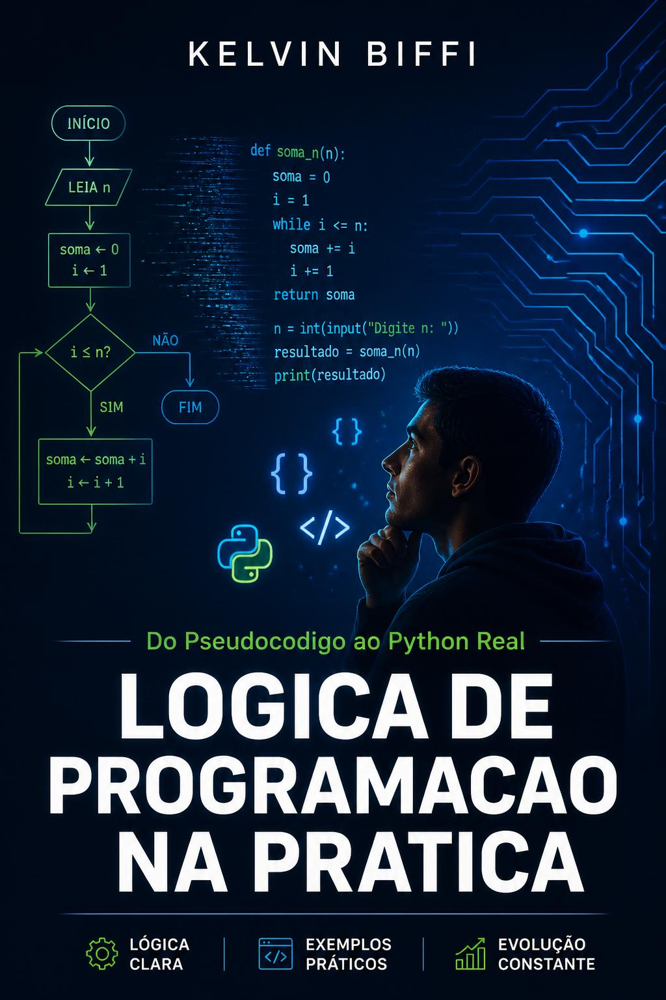

# Lógica de Programação na Prática

**Do Pseudocódigo ao Python Real — Para Quem Quer Entender, Não Só Copiar**



Repositório oficial com todos os exemplos de código e exercícios resolvidos do livro **Lógica de Programação na Prática**, de Kelvin Biffi.

> Este livro entrega o que tutoriais não dão: o raciocínio antes da sintaxe.  
> Cada capítulo segue o método **Pseudocódigo → Fluxograma → Python**.

---

## Como usar este repositório

Cada pasta corresponde a um capítulo do livro. Você pode rodar qualquer exemplo direto no terminal:

```bash
python cap-05-sequencia/troco.py
```

Sem dependências externas — apenas Python 3.8 ou superior.

Para validar que tudo funciona na sua máquina:

```bash
python testar_tudo.py
```

Esperado: **109/109 testes passando**.

---

## Mapa do livro

| Pasta | Capítulo do livro |
|---|---|
| [cap-01-instrucoes](cap-01-instrucoes/) | Cap. 1 — Instruções São Tudo |
| [cap-02-dados](cap-02-dados/) | Cap. 2 — Dados São Informação |
| [cap-03-algoritmos](cap-03-algoritmos/) | Cap. 3 — Algoritmos Já Existem na Sua Vida |
| [cap-04-erros](cap-04-erros/) | Cap. 4 — Erros São Parte do Processo |
| [cap-05-sequencia](cap-05-sequencia/) | Cap. 5 — Sequência: A Base de Tudo |
| [cap-06-decisao](cap-06-decisao/) | Cap. 6 — Decisão: O IF que Você Já Usa |
| [cap-07-decisoes-encadeadas](cap-07-decisoes-encadeadas/) | Cap. 7 — Decisões Encadeadas |
| [cap-08-for](cap-08-for/) | Cap. 8 — Repetição com FOR |
| [cap-09-while](cap-09-while/) | Cap. 9 — While: Repetindo até Acontecer |
| [cap-10-listas](cap-10-listas/) | Cap. 10 — Listas: Guardando Vários Valores |
| [cap-11-funcoes](cap-11-funcoes/) | Cap. 11 — Funções: Reutilize o Raciocínio |
| [cap-12-programa-completo](cap-12-programa-completo/) | Cap. 12 — Seu Primeiro Programa Completo |
| [cap-13-erros-python](cap-13-erros-python/) | Cap. 13 — Lendo Erros como um Programador |
| [cap-14-processo](cap-14-processo/) | Cap. 14 — Do Pseudocódigo ao Python |
| [cap-15-revisao](cap-15-revisao/) | Cap. 15 — O Que Você Aprendeu |
| [apendice-30-dias](apendice-30-dias/) | Apêndice — Seus Primeiros 30 Dias em Python |
| [exercicios-resolvidos](exercicios-resolvidos/) | Soluções de todos os exercícios |

---

## Onde comprar o livro

📕 **Em breve no Kindle** — Amazon Brasil  
*(link será adicionado após a publicação)*

---

## Sobre o autor

**Kelvin Biffi** é desenvolvedor e autor de outros livros técnicos publicados na Amazon:

- Context Engineering: O Guia Definitivo para LLMs
- Spec Driven Development na Prática
- Agentes de IA com Python
- MCP na Prática com Python
- JavaScript: Básico ao Avançado
- TypeScript na Prática

---

## Licença

Código sob licença MIT. Use, modifique, redistribua livremente.  
O texto do livro é protegido por direitos autorais e não está incluído neste repositório.
